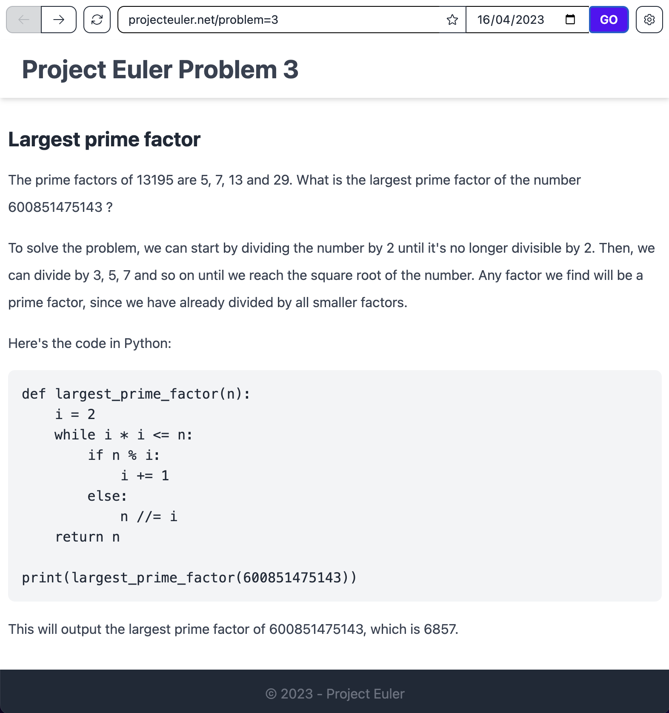
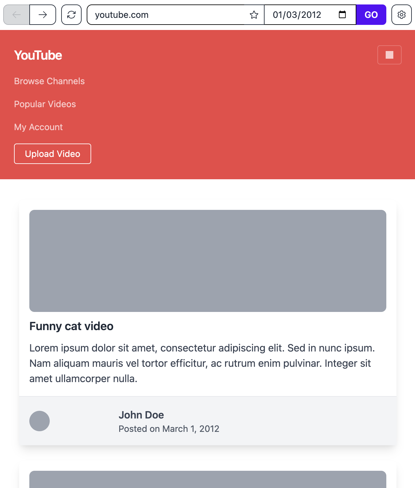
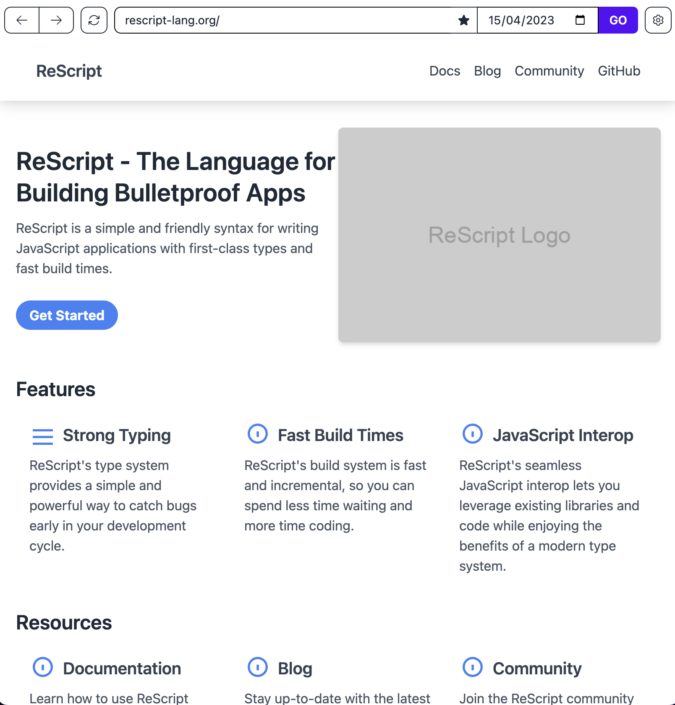
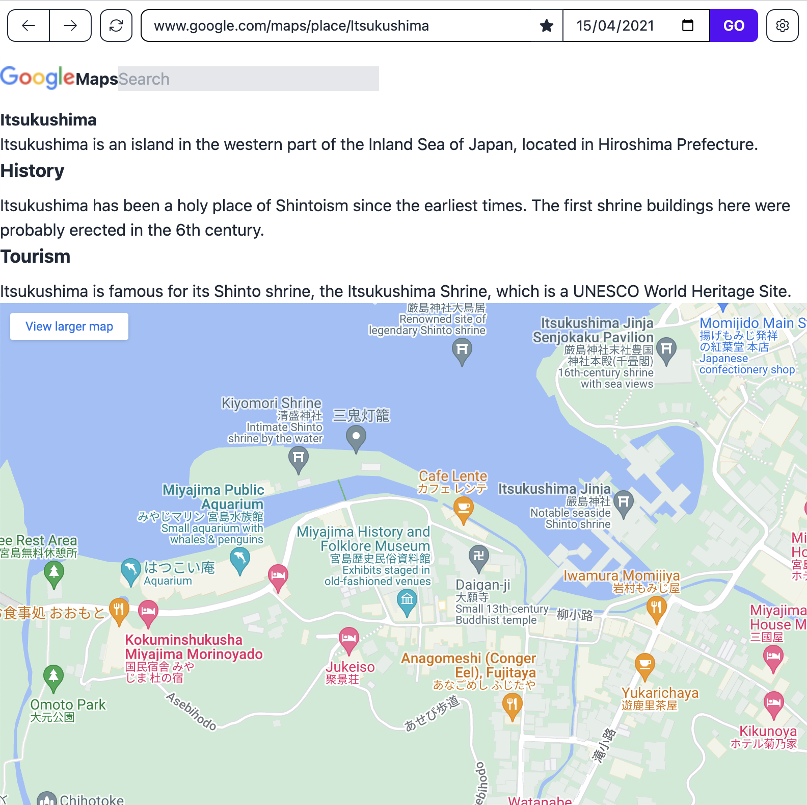

# LLMirage

LLMirage provides access to a hallucinated version of the web, generated by OpenAI's GPT-3.5.

## Features

- Real-time preview of the generated content
- Results are cached
- Navigation history
- Date picker to generate older / newer versions of the websites
- Bookmarks
- Dark Mode
- Cusomizable output temperature

## Examples

## Ideas

- Add a mode where a first prompt asks the model to come up with a detailed specification of the page's content and style, and feed this specification to a second pass which should generate the page.
- Parse links and generate the a new page at the new URL when clicked.